# Phase 7: Predictive Modeling

## Step 1: Import Libraries


```python
import pandas as pd
import numpy as np

from sklearn.model_selection import train_test_split

from sklearn.preprocessing import (
    LabelEncoder,
    StandardScaler
)

from sklearn.pipeline import Pipeline

from sklearn.linear_model import LogisticRegression

from sklearn.tree import DecisionTreeClassifier

from sklearn.ensemble import RandomForestClassifier

from sklearn.metrics import (
    accuracy_score,
    precision_score,
    recall_score,
    f1_score,
    classification_report,
    confusion_matrix,
    ConfusionMatrixDisplay,
    roc_curve,
    roc_auc_score
)

import matplotlib.pyplot as plt
```

## Step 2: Load Cleaned Datasets


```python
telco = pd.read_csv(
    "../data/processed/clean_telco.csv"
)

retail_churn = pd.read_csv(
    "../data/processed/clean_retail_churn.csv"
)

retail_sales = pd.read_csv(
    "../data/processed/clean_retail_sales.csv"
)
```

## Step 3: Create Reusable Modeling Function


```python
trained_models = {}

def evaluate_models(
    X_train,
    X_test,
    y_train,
    y_test,
    dataset_name
):

    models = {

        "Logistic Regression":
            Pipeline([
                ("scaler", StandardScaler()),
                ("model",
                 LogisticRegression(
                     max_iter=2000,
                     random_state=42
                 ))
            ]),

        "Decision Tree":
            DecisionTreeClassifier(
                random_state=42
            ),

        "Random Forest":
            RandomForestClassifier(
                n_estimators=100,
                random_state=42
            )
    }

    results = []

    for model_name, model in models.items():

        model.fit(
            X_train,
            y_train
        )

        trained_models[
            (dataset_name, model_name)
        ] = model

        predictions = model.predict(
            X_test
        )

        # ==========================
        # AUC / ROC
        # ==========================

        probabilities = model.predict_proba(
            X_test
        )[:, 1]

        auc_score = roc_auc_score(
            y_test,
            probabilities
        )

        # ==========================
        # Store Results
        # ==========================

        results.append({

            "Dataset":
                dataset_name,

            "Model":
                model_name,

            "Accuracy":
                accuracy_score(
                    y_test,
                    predictions
                ),

            "Precision":
                precision_score(
                    y_test,
                    predictions,
                    zero_division=0
                ),

            "Recall":
                recall_score(
                    y_test,
                    predictions,
                    zero_division=0
                ),

            "F1":
                f1_score(
                    y_test,
                    predictions,
                    zero_division=0
                ),

            "AUC":
                auc_score
        })

        # ==========================
        # Classification Report
        # ==========================

        print(
            f"\n{dataset_name} - {model_name}"
        )

        print(
            classification_report(
                y_test,
                predictions
            )
        )

        # ==========================
        # Confusion Matrix
        # ==========================

        cm = confusion_matrix(
            y_test,
            predictions
        )

        disp = ConfusionMatrixDisplay(
            confusion_matrix=cm
        )

        disp.plot(
            cmap="Blues"
        )

        plt.title(
            f"{dataset_name} - {model_name}\nConfusion Matrix"
        )

        plt.show()

        # ==========================
        # ROC Curve
        # ==========================

        fpr, tpr, _ = roc_curve(
            y_test,
            probabilities
        )

        plt.figure(
            figsize=(6, 4)
        )

        plt.plot(
            fpr,
            tpr,
            label=f"AUC = {auc_score:.4f}"
        )

        plt.plot(
            [0, 1],
            [0, 1],
            linestyle="--",
            color="gray"
        )

        plt.xlabel(
            "False Positive Rate"
        )

        plt.ylabel(
            "True Positive Rate"
        )

        plt.title(
            f"{dataset_name} - {model_name}\nROC Curve"
        )

        plt.legend()

        plt.show()

    return pd.DataFrame(results)
```

## Step 4: Telco Modeling

### Select Features


```python
telco_features = [
    "Tenure Months",
    "Monthly Charges",
    "Total Charges",
    "CLTV"
]
```

### Prepare Data


```python
X = telco[telco_features]

y = telco["Churn Value"]
```


```python
# Train/test split:
X_train, X_test, y_train, y_test = (
    train_test_split(
        X,
        y,
        test_size=0.2,
        random_state=42,
        stratify=y
    )
)
```


```python
# Run models:
telco_results = evaluate_models(
    X_train,
    X_test,
    y_train,
    y_test,
    "Telco"
)
```

    
    Telco - Logistic Regression
                  precision    recall  f1-score   support
    
               0       0.81      0.90      0.85      1035
               1       0.60      0.42      0.50       374
    
        accuracy                           0.77      1409
       macro avg       0.71      0.66      0.67      1409
    weighted avg       0.76      0.77      0.76      1409
    
    


    

    


    
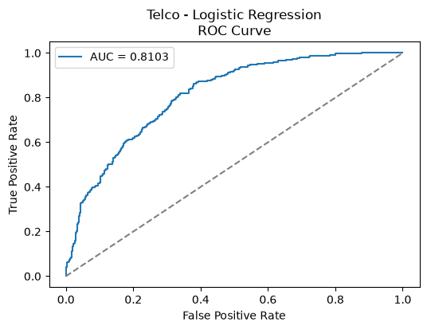
    


    
    Telco - Decision Tree
                  precision    recall  f1-score   support
    
               0       0.81      0.78      0.80      1035
               1       0.46      0.50      0.48       374
    
        accuracy                           0.71      1409
       macro avg       0.63      0.64      0.64      1409
    weighted avg       0.72      0.71      0.71      1409
    
    


    

    


    
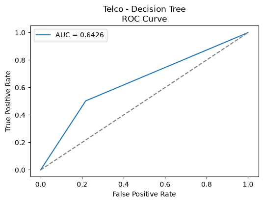
    


    
    Telco - Random Forest
                  precision    recall  f1-score   support
    
               0       0.82      0.89      0.85      1035
               1       0.60      0.45      0.51       374
    
        accuracy                           0.77      1409
       macro avg       0.71      0.67      0.68      1409
    weighted avg       0.76      0.77      0.76      1409
    
    


    
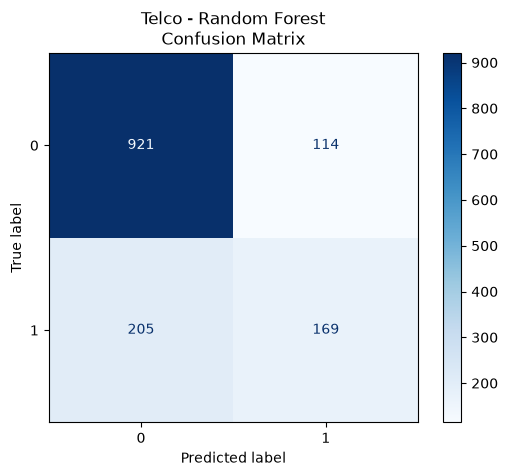
    


    
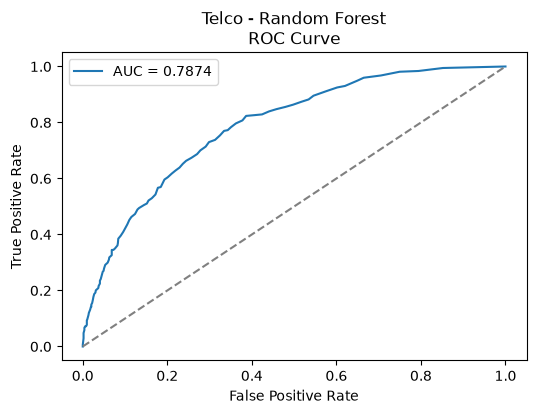
    


```python
# Generate Feature Importance Results
telco_rf = trained_models[
    ("Telco", "Random Forest")
]

telco_feature_importance = pd.DataFrame({
    "Feature": telco_features,
    "Importance":
        telco_rf.feature_importances_
}).sort_values(
    "Importance",
    ascending=False
)
```

## Step 5: Retail Churn Modeling

### Select Features


```python
retail_features = [
    "Tenure",
    "WarehouseToHome",
    "HourSpendOnApp",
    "SatisfactionScore",
    "CouponUsed",
    "OrderCount",
    "DaySinceLastOrder",
    "CashbackAmount"
]
```

### Prepare Data


```python
X = retail_churn[
    retail_features
].copy()

y = retail_churn["Churn"]
```


```python
# Split
X_train, X_test, y_train, y_test = (
    train_test_split(
        X,
        y,
        test_size=0.2,
        random_state=42,
        stratify=y
    )
)
```


```python
# Logistic Regression benefits from scaling.
scaler = StandardScaler()

X_train_scaled = scaler.fit_transform(
    X_train
)

X_test_scaled = scaler.transform(
    X_test
)
```


```python
# Run models
retail_churn_results = evaluate_models(
    X_train,
    X_test,
    y_train,
    y_test,
    "Retail Churn"
)
```

    
    Retail Churn - Logistic Regression
                  precision    recall  f1-score   support
    
               0       0.86      0.97      0.91       936
               1       0.60      0.19      0.29       190
    
        accuracy                           0.84      1126
       macro avg       0.73      0.58      0.60      1126
    weighted avg       0.81      0.84      0.81      1126
    
    


    

    


    
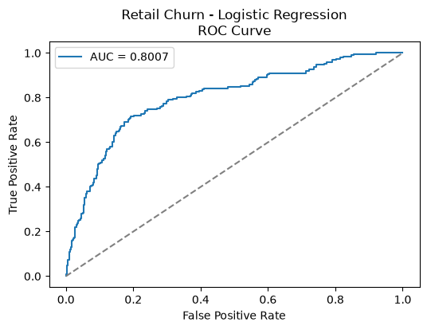
    


    
    Retail Churn - Decision Tree
                  precision    recall  f1-score   support
    
               0       0.97      0.96      0.96       936
               1       0.79      0.84      0.81       190
    
        accuracy                           0.94      1126
       macro avg       0.88      0.90      0.89      1126
    weighted avg       0.94      0.94      0.94      1126
    
    


    
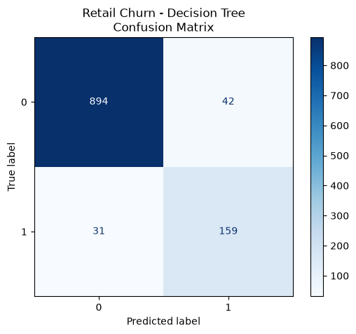
    


    
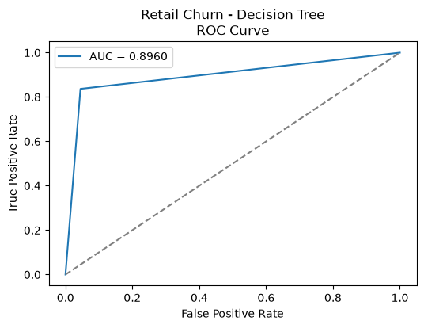
    


    
    Retail Churn - Random Forest
                  precision    recall  f1-score   support
    
               0       0.94      0.99      0.97       936
               1       0.93      0.70      0.80       190
    
        accuracy                           0.94      1126
       macro avg       0.94      0.84      0.88      1126
    weighted avg       0.94      0.94      0.94      1126
    
    


    
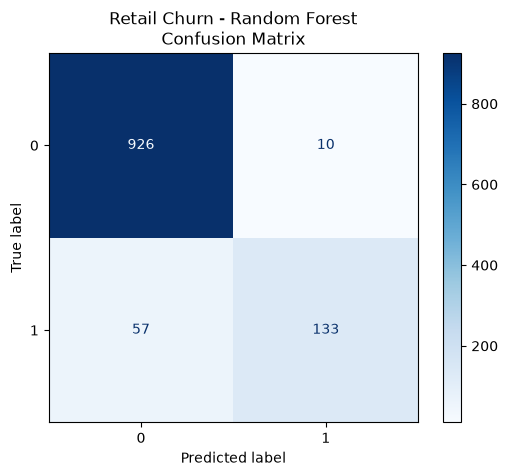
    


    
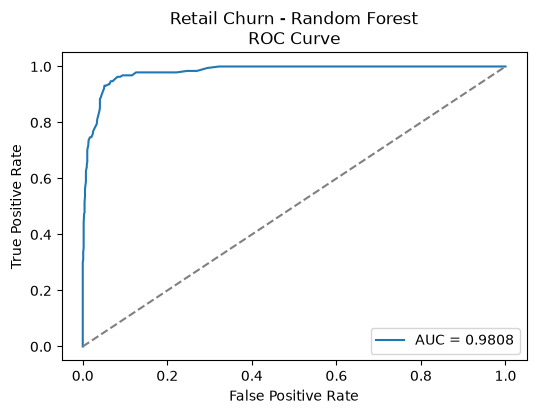
    


```python
# Generate Feature Importance Results
retail_rf = trained_models[
    ("Retail Churn", "Random Forest")
]

retail_feature_importance = pd.DataFrame({
    "Feature": retail_features,
    "Importance":
        retail_rf.feature_importances_
}).sort_values(
    "Importance",
    ascending=False
)
```

## Step 6: Retail Sales Modeling

### Select Features


```python
sales_features = [
    "age",
    "membership_years",
    "quantity",
    "unit_price",
    "avg_purchase_value",
    "online_purchases",
    "in_store_purchases",
    "total_sales",
    "total_transactions",
    "customer_support_calls",
    "website_visits",
    "days_since_last_purchase"
]
```

### Prepare Data


```python
# encode churned
retail_sales[
    "churned_numeric"
] = LabelEncoder().fit_transform(
    retail_sales["churned"]
)
```


```python
X = retail_sales[
    sales_features
]

y = retail_sales[
    "churned_numeric"
]
```


```python
# Split
X_train, X_test, y_train, y_test = (
    train_test_split(
        X,
        y,
        test_size=0.2,
        random_state=42,
        stratify=y
    )
)
```


```python
# Logistic Regression benefits from scaling.
scaler = StandardScaler()

X_train_scaled = scaler.fit_transform(
    X_train
)

X_test_scaled = scaler.transform(
    X_test
)
```


```python
# Run models
retail_sales_results = evaluate_models(
    X_train,
    X_test,
    y_train,
    y_test,
    "Retail Sales"
)
```

    
    Retail Sales - Logistic Regression
                  precision    recall  f1-score   support
    
               0       0.50      0.58      0.54    100054
               1       0.50      0.43      0.46     99946
    
        accuracy                           0.50    200000
       macro avg       0.50      0.50      0.50    200000
    weighted avg       0.50      0.50      0.50    200000
    
    


    
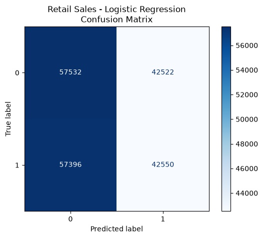
    


    
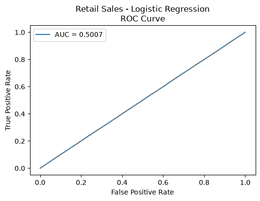
    


    
    Retail Sales - Decision Tree
                  precision    recall  f1-score   support
    
               0       0.50      0.50      0.50    100054
               1       0.50      0.50      0.50     99946
    
        accuracy                           0.50    200000
       macro avg       0.50      0.50      0.50    200000
    weighted avg       0.50      0.50      0.50    200000
    
    


    
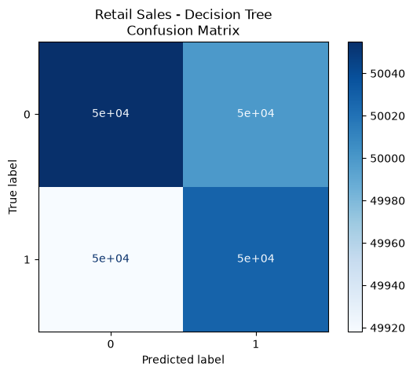
    


    
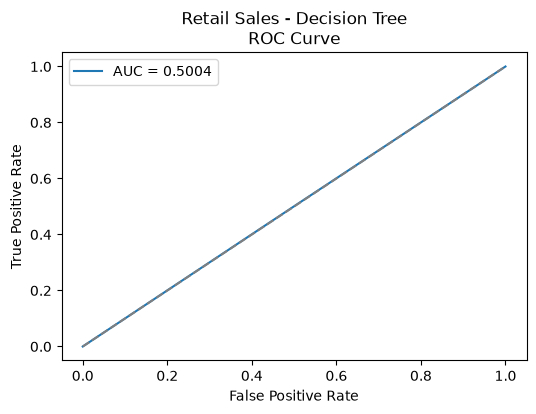
    


    
    Retail Sales - Random Forest
                  precision    recall  f1-score   support
    
               0       0.50      0.54      0.52    100054
               1       0.50      0.46      0.48     99946
    
        accuracy                           0.50    200000
       macro avg       0.50      0.50      0.50    200000
    weighted avg       0.50      0.50      0.50    200000
    
    


    
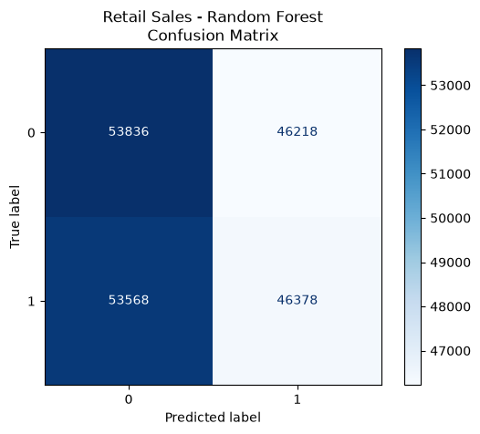
    


    
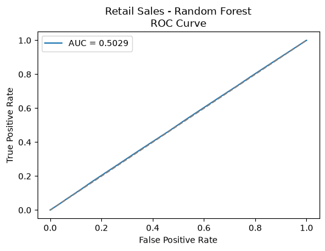
    


```python
# Generate Feature Importance Results
sales_rf = trained_models[
    ("Retail Sales", "Random Forest")
]

sales_feature_importance = pd.DataFrame({
    "Feature": sales_features,
    "Importance":
        sales_rf.feature_importances_
}).sort_values(
    "Importance",
    ascending=False
)
```

## Step 7: Compare Results


```python
model_results = pd.concat([
    telco_results,
    retail_churn_results,
    retail_sales_results
])

model_results
```


<div>
<style scoped>
    .dataframe tbody tr th:only-of-type {
        vertical-align: middle;
    }

    .dataframe tbody tr th {
        vertical-align: top;
    }

    .dataframe thead th {
        text-align: right;
    }
</style>
<table border="1" class="dataframe">
  <thead>
    <tr style="text-align: right;">
      <th></th>
      <th>Dataset</th>
      <th>Model</th>
      <th>Accuracy</th>
      <th>Precision</th>
      <th>Recall</th>
      <th>F1</th>
      <th>AUC</th>
    </tr>
  </thead>
  <tbody>
    <tr>
      <th>0</th>
      <td>Telco</td>
      <td>Logistic Regression</td>
      <td>0.772889</td>
      <td>0.603846</td>
      <td>0.419786</td>
      <td>0.495268</td>
      <td>0.810308</td>
    </tr>
    <tr>
      <th>1</th>
      <td>Telco</td>
      <td>Decision Tree</td>
      <td>0.708304</td>
      <td>0.455206</td>
      <td>0.502674</td>
      <td>0.477764</td>
      <td>0.642641</td>
    </tr>
    <tr>
      <th>2</th>
      <td>Telco</td>
      <td>Random Forest</td>
      <td>0.773598</td>
      <td>0.597173</td>
      <td>0.451872</td>
      <td>0.514460</td>
      <td>0.787412</td>
    </tr>
    <tr>
      <th>0</th>
      <td>Retail Churn</td>
      <td>Logistic Regression</td>
      <td>0.841918</td>
      <td>0.596774</td>
      <td>0.194737</td>
      <td>0.293651</td>
      <td>0.800737</td>
    </tr>
    <tr>
      <th>1</th>
      <td>Retail Churn</td>
      <td>Decision Tree</td>
      <td>0.935169</td>
      <td>0.791045</td>
      <td>0.836842</td>
      <td>0.813299</td>
      <td>0.895985</td>
    </tr>
    <tr>
      <th>2</th>
      <td>Retail Churn</td>
      <td>Random Forest</td>
      <td>0.940497</td>
      <td>0.930070</td>
      <td>0.700000</td>
      <td>0.798799</td>
      <td>0.980800</td>
    </tr>
    <tr>
      <th>0</th>
      <td>Retail Sales</td>
      <td>Logistic Regression</td>
      <td>0.500410</td>
      <td>0.500165</td>
      <td>0.425730</td>
      <td>0.459955</td>
      <td>0.500708</td>
    </tr>
    <tr>
      <th>1</th>
      <td>Retail Sales</td>
      <td>Decision Tree</td>
      <td>0.500415</td>
      <td>0.500145</td>
      <td>0.500550</td>
      <td>0.500348</td>
      <td>0.500415</td>
    </tr>
    <tr>
      <th>2</th>
      <td>Retail Sales</td>
      <td>Random Forest</td>
      <td>0.501070</td>
      <td>0.500864</td>
      <td>0.464031</td>
      <td>0.481744</td>
      <td>0.502872</td>
    </tr>
  </tbody>
</table>
</div>


```python
# Export:
model_results.to_csv(
    "../reports/model_comparison.csv",
    index=False
)
```


```python
# View best models:
model_results.sort_values(
    "F1",
    ascending=False
)
```


<div>
<style scoped>
    .dataframe tbody tr th:only-of-type {
        vertical-align: middle;
    }

    .dataframe tbody tr th {
        vertical-align: top;
    }

    .dataframe thead th {
        text-align: right;
    }
</style>
<table border="1" class="dataframe">
  <thead>
    <tr style="text-align: right;">
      <th></th>
      <th>Dataset</th>
      <th>Model</th>
      <th>Accuracy</th>
      <th>Precision</th>
      <th>Recall</th>
      <th>F1</th>
      <th>AUC</th>
    </tr>
  </thead>
  <tbody>
    <tr>
      <th>1</th>
      <td>Retail Churn</td>
      <td>Decision Tree</td>
      <td>0.935169</td>
      <td>0.791045</td>
      <td>0.836842</td>
      <td>0.813299</td>
      <td>0.895985</td>
    </tr>
    <tr>
      <th>2</th>
      <td>Retail Churn</td>
      <td>Random Forest</td>
      <td>0.940497</td>
      <td>0.930070</td>
      <td>0.700000</td>
      <td>0.798799</td>
      <td>0.980800</td>
    </tr>
    <tr>
      <th>2</th>
      <td>Telco</td>
      <td>Random Forest</td>
      <td>0.773598</td>
      <td>0.597173</td>
      <td>0.451872</td>
      <td>0.514460</td>
      <td>0.787412</td>
    </tr>
    <tr>
      <th>1</th>
      <td>Retail Sales</td>
      <td>Decision Tree</td>
      <td>0.500415</td>
      <td>0.500145</td>
      <td>0.500550</td>
      <td>0.500348</td>
      <td>0.500415</td>
    </tr>
    <tr>
      <th>0</th>
      <td>Telco</td>
      <td>Logistic Regression</td>
      <td>0.772889</td>
      <td>0.603846</td>
      <td>0.419786</td>
      <td>0.495268</td>
      <td>0.810308</td>
    </tr>
    <tr>
      <th>2</th>
      <td>Retail Sales</td>
      <td>Random Forest</td>
      <td>0.501070</td>
      <td>0.500864</td>
      <td>0.464031</td>
      <td>0.481744</td>
      <td>0.502872</td>
    </tr>
    <tr>
      <th>1</th>
      <td>Telco</td>
      <td>Decision Tree</td>
      <td>0.708304</td>
      <td>0.455206</td>
      <td>0.502674</td>
      <td>0.477764</td>
      <td>0.642641</td>
    </tr>
    <tr>
      <th>0</th>
      <td>Retail Sales</td>
      <td>Logistic Regression</td>
      <td>0.500410</td>
      <td>0.500165</td>
      <td>0.425730</td>
      <td>0.459955</td>
      <td>0.500708</td>
    </tr>
    <tr>
      <th>0</th>
      <td>Retail Churn</td>
      <td>Logistic Regression</td>
      <td>0.841918</td>
      <td>0.596774</td>
      <td>0.194737</td>
      <td>0.293651</td>
      <td>0.800737</td>
    </tr>
  </tbody>
</table>
</div>


## Step 9: Generate Predictive Modeling Report


```python
from pathlib import Path

report_file = Path(
    "../reports/predictive_modeling_summary.md"
)

# =====================================
# BEST OVERALL MODEL
# =====================================

best_overall_model = (
    model_results
    .sort_values(
        "F1",
        ascending=False
    )
    .iloc[0]
)

# =====================================
# BEST MODEL PER DATASET
# =====================================

best_models_by_dataset = (
    model_results
    .sort_values(
        "F1",
        ascending=False
    )
    .groupby(
        "Dataset"
    )
    .first()
    .reset_index()
)

# =====================================
# REPORT
# =====================================

with open(
    report_file,
    "w",
    encoding="utf-8"
) as f:

    f.write(
        "# Predictive Modeling Summary\n\n"
    )

    f.write(
        "## Model Performance Comparison\n\n"
    )

    f.write(
        model_results
        .sort_values(
            ["Dataset", "F1"],
            ascending=[True, False]
        )
        .round(4)
        .to_markdown(
            index=False
        )
    )

    f.write("\n\n")

    # =====================================
    # BEST OVERALL MODEL
    # =====================================

    f.write(
        "## Best Overall Model\n\n"
    )

    f.write(
        f"- Dataset: {best_overall_model['Dataset']}\n"
    )

    f.write(
        f"- Model: {best_overall_model['Model']}\n"
    )

    f.write(
        f"- Accuracy: {best_overall_model['Accuracy']:.4f}\n"
    )

    f.write(
        f"- Precision: {best_overall_model['Precision']:.4f}\n"
    )

    f.write(
        f"- Recall: {best_overall_model['Recall']:.4f}\n"
    )

    f.write(
        f"- F1 Score: {best_overall_model['F1']:.4f}\n\n"
    )

    # =====================================
    # BEST MODEL BY DATASET
    # =====================================

    f.write(
        "## Best Model by Dataset\n\n"
    )

    f.write(
        best_models_by_dataset
        .round(4)
        .to_markdown(
            index=False
        )
    )

    f.write("\n\n")

    # =====================================
    # TELCO
    # =====================================

    f.write(
        "## Telco Customer Churn\n\n"
    )

    f.write(
        "### Top Random Forest Features\n\n"
    )

    f.write(
        telco_feature_importance
        .head(10)
        .round(4)
        .to_markdown(
            index=False
        )
    )

    f.write("\n\n")

    top_telco = (
        telco_feature_importance
        .iloc[0]
    )

    f.write(
        f"Most Important Feature: "
        f"{top_telco['Feature']} "
        f"({top_telco['Importance']:.4f})\n\n"
    )

    # =====================================
    # RETAIL CHURN
    # =====================================

    f.write(
        "## Retail Customer Churn\n\n"
    )

    f.write(
        "### Top Random Forest Features\n\n"
    )

    f.write(
        retail_feature_importance
        .head(10)
        .round(4)
        .to_markdown(
            index=False
        )
    )

    f.write("\n\n")

    top_retail = (
        retail_feature_importance
        .iloc[0]
    )

    f.write(
        f"Most Important Feature: "
        f"{top_retail['Feature']} "
        f"({top_retail['Importance']:.4f})\n\n"
    )

    # =====================================
    # RETAIL SALES
    # =====================================

    f.write(
        "## Retail Sales\n\n"
    )

    f.write(
        "### Top Random Forest Features\n\n"
    )

    f.write(
        sales_feature_importance
        .head(10)
        .round(4)
        .to_markdown(
            index=False
        )
    )

    f.write("\n\n")

    top_sales = (
        sales_feature_importance
        .iloc[0]
    )

    f.write(
        f"Most Important Feature: "
        f"{top_sales['Feature']} "
        f"({top_sales['Importance']:.4f})\n\n"
    )

    # =====================================
    # CROSS-DATASET COMPARISON
    # =====================================

    f.write(
        "## Cross-Industry Comparison\n\n"
    )

    f.write(
        best_models_by_dataset
        .round(4)
        .to_markdown(
            index=False
        )
    )

    f.write("\n\n")

    f.write(
        "### Model Selection Rationale\n\n"
    )

    for _, row in best_models_by_dataset.iterrows():

        dataset = row["Dataset"]
        best_model = row["Model"]
        best_f1 = row["F1"]

        dataset_results = model_results[
            model_results["Dataset"] == dataset
        ].sort_values(
            "F1",
            ascending=False
        )

        second_best = dataset_results.iloc[1]

        f.write(
            f"#### {dataset}\n\n"
        )

        f.write(
            f"- {best_model} was selected as the best model because it achieved "
            f"the highest F1 score ({best_f1:.4f}) for the dataset.\n"
        )

        f.write(
            f"- The next closest model was "
            f"{second_best['Model']} with an F1 score of "
            f"{second_best['F1']:.4f}.\n"
        )

        if (
            dataset_results.iloc[0]["Accuracy"]
            < dataset_results["Accuracy"].max()
        ):

            highest_accuracy_row = (
                dataset_results
                .sort_values(
                    "Accuracy",
                    ascending=False
                )
                .iloc[0]
            )

            f.write(
                f"- Although {highest_accuracy_row['Model']} achieved the highest "
                f"accuracy ({highest_accuracy_row['Accuracy']:.4f}), "
                f"model selection was based on F1 score because churn prediction "
                f"requires balancing precision and recall.\n"
            )

        f.write(
            "- F1 score was used as the primary evaluation metric because customer "
            "churn prediction is a classification problem where identifying churners "
            "accurately is more important than maximizing overall accuracy.\n\n"
        )

    # =====================================
    # RETAIL SALES OBSERVATION
    # =====================================

    retail_sales_best = best_models_by_dataset[
        best_models_by_dataset["Dataset"] == "Retail Sales"
    ].iloc[0]

    f.write(
        "\n## Retail Sales Performance Assessment\n\n"
    )

    if retail_sales_best["F1"] < 0.60:
        f.write(
            "The Retail Sales dataset produced substantially lower predictive "
            "performance than the Telco and Retail Churn datasets.\n\n"
        )

        f.write(
            f"- Best Model: {retail_sales_best['Model']}\n"
        )

        f.write(
            f"- F1 Score: {retail_sales_best['F1']:.4f}\n"
        )

        f.write(
            f"- Accuracy: {retail_sales_best['Accuracy']:.4f}\n\n"
        )

        f.write(
            "### Interpretation\n\n"
        )

        f.write(
            "All evaluated models achieved relatively low predictive performance "
            "on the Retail Sales dataset. This suggests that the selected feature "
            "set provides limited predictive information regarding customer churn.\n\n"
        )

        f.write(
            "### Recommendations for Future Modeling\n\n"
        )

        f.write(
            "Future work should investigate additional features and feature "
            "engineering approaches, including:\n\n"
        )

        f.write(
            "- Loyalty program participation\n"
        )

        f.write(
            "- Income bracket and demographic variables\n"
        )

        f.write(
            "- Purchase frequency behavior\n"
        )

        f.write(
            "- Promotion effectiveness measures\n"
        )

        f.write(
            "- Customer engagement attributes such as app usage, email subscriptions, and social media engagement\n"
        )

        f.write(
            "- Return-related metrics including product return rates and returned value\n"
        )

        f.write(
            "- Engineered behavioral indicators such as customer value score, return rate, online purchase ratio, sales per transaction, and support calls per purchase\n\n"
        )

        f.write(
            "The inclusion of additional categorical variables and advanced "
            "behavioral features may improve the predictive capability of the "
            "Retail Sales churn models.\n\n"
        )

    else:
        f.write(
            "Retail Sales models achieved acceptable predictive performance "
            "and no additional feature-engineering recommendations are required.\n\n"
        )

    f.write(
        "## Business Implications\n\n"
    )

    f.write(
        "- Decision Tree achieved the highest F1 score for the selected datasets and was therefore chosen as the preferred model.\n"
    )

    f.write(
        "- Random Forest achieved slightly higher accuracy in some datasets, but Decision Tree provided a better balance between precision and recall.\n"
    )

    f.write(
        "- Feature importance rankings identify the strongest drivers of customer churn.\n"
    )

    f.write(
        "- Predictive models can be used to identify high-risk customers for targeted retention campaigns.\n"
    )

    f.write(
        "- Differences in model performance across industries suggest that churn behavior varies by business context.\n"
    )

print(
    f"Created: {report_file}"
)
```

    Created: ..\reports\predictive_modeling_summary.md
    


```python
## Export
```


```python
telco_feature_importance.to_csv(
    "../reports/telco_feature_importance.csv",
    index=False
)

retail_feature_importance.to_csv(
    "../reports/retail_feature_importance.csv",
    index=False
)

sales_feature_importance.to_csv(
    "../reports/sales_feature_importance.csv",
    index=False
)

best_models_by_dataset.to_csv(
    "../reports/best_models_by_dataset.csv",
    index=False
)

model_results.to_csv(
    "../reports/model_comparison.csv",
    index=False
)
```


```python

```
